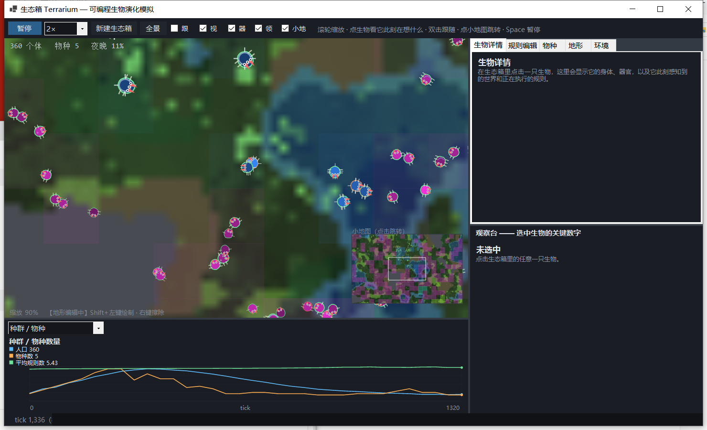
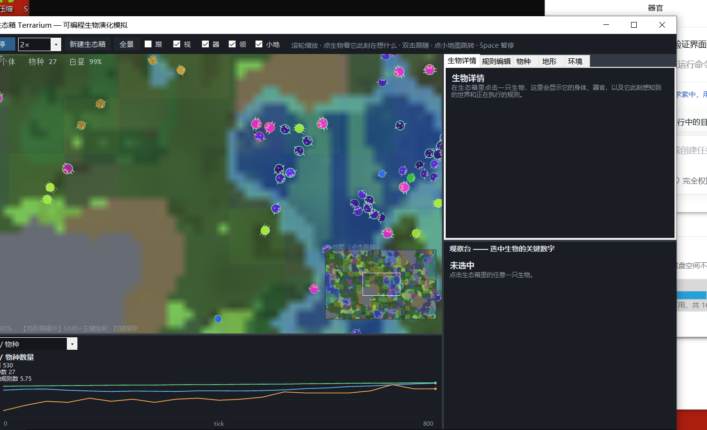

# 生态箱 Terrarium

> 一个可以**造物、给它定规则、看它们在生态箱里搏斗、并且真的会自己演化**的桌面程序。

C# / .NET 9 / WinForms，**零第三方依赖**，发布为单个自包含 exe（45 MB，双击即用，不需要装 .NET）。

> **关于开发方式**：本项目的代码与文档由作者与 AI（DeepSeek）协作完成，**含 AI 生成内容**。
> 需求、设计取舍、验证标准和最终决定由作者作出；所有结论都经过实际运行验证，
> 但请自行判断其正确性。

---

## 它长什么样



左边是生态箱（滚轮缩放、右键平移、双击跟随），右边是四个面板，底部是种群曲线。



卡片式规则编辑器 —— 点生态箱里任意一只生物，就能看到它的基因组并直接改。

---

## 快速上手

**双击 `dist\Terrarium.exe`。** 不需要安装任何东西。

进去之后建议这么做：

1. 看几秒，让它跑起来（默认 2× 速度）。默认镜头是**拉近**的，能看到生物的身体形状和器官；
   右下角小地图给全局方位，点它可以跳转。
2. 按 **空格** 暂停。
3. 在生态箱里**点一只生物** —— 右边「生物详情」会显示它的器官、身体属性，
   以及**它此刻感知到的每一个数字和正在执行的那一条规则**。
4. 切到「规则编辑」，改一个阈值（比如把「能量 > 0.82 就繁殖」改成 0.6），
   按「保存到选中」，再按空格继续 —— 看它的行为怎么变。
5. 切到「地形」，按「打开地形编辑」，然后**挖一条河**或者**立一道山脊** ——
   看种群被冲成两岸两支、或者隔着一道岩壁各自演化。
6. 切到「物种」，看当前有几个物种、各自长什么样；切到「环境」调生态箱的旋钮。

### 键盘与鼠标

| 操作 | 作用 |
|---|---|
| `空格` | 暂停 / 继续 |
| `1`–`6` | 速度 1× / 2× / 5× / 20× / 100× / 极速 |
| `F` | 视角回到全景 |
| 滚轮 | 以光标为中心缩放 |
| 右键拖动 / 空白处拖动 | 平移 |
| 双击生物 | 跟随它 |
| 点小地图 | 镜头跳转 |
| **地形编辑模式下** | 左键拖拽绘制 · 右键拖拽擦成草地（此时不选中生物） |

---

## 它到底在做什么

每个生物由三部分组成：

- **器官**（10 种，各 0–5 级）：腿、眼、牙、甲、胃、藻胞、毒腺、生殖腺、鳃、棘。
  每个器官都是「**能量开销 ↔ 功能**」的交换，而且互相耦合
  （腿和甲都会加重体重，体重又反过来压低速度）。
  开销是**超线性**的（`等级^1.9`）—— 这是让「特化」能赢过「什么都点满」的关键。
  **器官还会改变身体形状**：腿让身体流线化、甲压平成多面体、牙把前端推出楔形、藻胞长出隆起。
- **规则**（卡片式）：`当 [条件] 且 [条件] → [动作]`，从上往下求值，
  第一条全部满足的规则触发。条件里的数字是可演化的。
- **元基因**：突变率本身也是基因，所以「进化能力」也会进化。

**演化不需要你设计适应度函数** —— 谁留下后代谁就赢。每只后代都会经历三层变异：

| 层 | 内容 |
|---|---|
| 参数微调 | 阈值 ± 高斯、器官等级 ±1 |
| 规则变异 | 换传感器 / 换算子 / 换动作 / 增删条件动作 |
| 结构变异 | 插入 / 删除 / **交换优先级** / 复制整条规则 / 分化新物种 |

---

## 世界是有结构的

八种地形，每种都在改变选择压力：

| 地形 | 通行 | 食物 | 视野 | 生态作用 |
|---|---|---|---|---|
| 草地 | ✓ | 中 | 1.0 | 基准 |
| 沃土 | ✓ | 高 | 1.0 | 领地争夺的焦点 |
| 灌木丛 | ✓ 慢 | 中 | **0.5** | 藏身处 → 伏击型掠食者 |
| 浅水 | ✓ | 中 | 1.0 | 水陆之间的**走廊** |
| 深水 | 仅带鳃 | 高 | 1.0 | 无鳃会溺 → 真正的屏障 |
| 沼泽 | ✓ 很慢 | 中 | 0.7 | 筛选腿与鳃的组合 |
| **岩石** | **✗** | 0 | — | **地理隔离 → 物种分化** |
| 荒漠 | ✓ | 极低 | 1.0 | 筛选耐饿与迁徙 |

**为什么这很重要**：在均质地图上，竞争排斥原理决定了最终只会剩一个赢家。
岩石把世界切成互不连通的区域之后，区域内的种群独立演化，物种才有可能真正分化。

你可以用「地形」页的 10 种笔刷手绘，也可以一键生成 6 种生物群系
（湖泊 / 山脉 / 群岛 / 丛林 / 荒漠 / 河谷）。每一笔都有撤销。

---

## 生物是有实体的

- **碰撞体积**：身体半径由体重决定，重叠时按体重反比推开，重的推不动。
  拥挤还要额外花能量 —— 所以"扎堆"是有代价的，群居和分散都需要权衡。
- **地形碰撞**：岩石不可通行，撞墙会贴墙滑行而不是硬停。
- **寻路**：预计算一张**逃逸距离场**（每个地块指向"往哪走能出去"）用于脱困；
  再加一层**有界局部 A\*** 用于真正绕障 —— 直线被岩石挡住时才触发，
  而且有每 tick 的调用与节点预算，所以开销有硬上限（实测约 6%）。
  效果是实打实的：人口 517 → 638、平均能量 44% → 50%（觅食效率提升）。
  配合「前方障碍距离」传感器，避障行为还能由演化自己学会，而不需要写死。
- **地形遮蔽**：灌木丛里视野砍半，成本只是乘一个系数，却造出了"伏击"这个战术生态位。

## 生物有一套 20 点的预算

15 个性状共享 **20 点，不可超过，但可以用不满**。这是整个设计里最核心的一条约束：

| 器官（10） | 移速 · 视野 · 攻击 · 减伤 · 能量上限 · 光合 · 中毒 · 繁殖门槛 · 水域 · 反伤 |
|---|---|
| **生活史（5）** | **寿命 · 繁殖间隔 · 幼体生命力 · 窝卵数 · 卵壳强度** |

**为什么要有硬上限**：在这之前我是靠"器官开销随等级超线性增长"来压制"什么都点满"的 ——
那是个经济补丁，食物一多，全场还是会长成一模一样的全能型（实测过一次：体重 21、
全器官 3–5、战力 1.00）。硬上限是从**结构上**禁止这件事：15 项里最多点满 4 项。

**后 5 项以前根本不可演化**：寿命和繁殖间隔是写死的全局常量（3600 / 80），
所有生物一模一样；幼体生命力、窝卵数、卵壳强度压根不存在。生态里最要紧的几个轴
全在演化之外，这是当时最大的设计漏洞。

实跑 6 万 tick，平均已用 **12.6–13.6 点** —— 约束是硬的，但生态最优解在约束之下。
用不满的生物更轻、每 tick 开销更低，于是"躺平省钱"从隐性行为变成了一张明牌。

## 生命有阶段：卵 → 幼体 → 成体

繁殖不再是"直接造一个个体"，而是**产下一窝卵**：

- **卵**固定不动，**被非同族踩 5 次就销毁**。5 这个数字不是全局配置 ——
  它是「卵壳强度」买来的（0 级 1 次，每级 +2）。同族不踩，判定用卵记录的亲代签名
  （亲代常常在孵化前就死了，但敌友不能因此失效）。
- 卵是生态里**第一种"不用搏斗就能吃"的资源**。于是「抢劫卵」和「护卵」
  成了两个新生态位，而且不需要专门写代码，只是规则组合。
  实测 6 万 tick：孵化 11821 次、被踩碎 2585 颗（约 18%）。
- **幼体**属性按成熟度缩放、不能繁殖、画面上更小更淡。长期占种群的 51%–66%。
- **窝卵数**把 r/K 策略轴明牌化：投入总量固定，卵越多每颗越弱。

## 世界是可以改造和保存的

- **10 种笔刷**手绘地形：种植物 / 除植物 / 沃土 / 草地 / 灌木 / 浅水 / 深水 / 沼泽 / 岩石 / 荒漠。
- **一键生成 6 种生物群系**：湖泊 / 山脉 / 群岛 / 丛林 / 荒漠 / 河谷。
- **每一笔都能撤销**（差异栈，一次拖拽 = 一次撤销单位）。
- **地图可存档**：`保存地图` / `载入地图`，存地形 + 肥力 + 相关配置，
  实测 151 KB（gzip）。生物不存 —— "地图 + 种子"能精确重放整个演化史。
- **寻路**：逃逸距离场 + 有界局部 A\*（直线被岩石挡住才触发，有每 tick 调用与节点预算，
  实测开销约 6%）。效果是实打实的：人口 517 → 638、平均能量 44% → 50%。

---

## 实测到的现象

这些不是设计目标，是真跑出来的结果：

- **突变率自发下降**：0.35 → 0.13–0.29。稳定环境里的保守化。
- **规则数先膨胀后收敛**：5 → 13.6（无成本时）→ 5–9（加上神经系统维持成本后）。
- **捕食者-猎物周期**：掠食者占比在 2%–72% 之间震荡，而不是恒定占优。
- **体型的两条演化路径**：食物充裕时体重涨到 5.9（大就是强）；
  食物成为限制后反向降到 2.0 —— 生物学会了"躺平省钱"。
- **性能**：把感知-决策阶段并行化后 363 → 765 tick/s（2.1×），
  而且同种子输出仍然逐字节一致。

### 一次彻底的重做：捕食者 / 食草者体系

**这一节值得单独读，因为它是从"设计缺陷"被揪出来的完整过程。**

第一版的表现是：6 个种子里有 5 个的**战力都涨到 0.90–0.94**，
4.5 万 tick 内猎杀 6.6 万到 29.6 万次。不是"掠食者强势"，是**每个人都在吃每个人**的绞肉机。

根因是一个算术错误 —— 我破坏了能量守恒：

```csharp
// 修复前：这一项是凭空造能量
float gain = target.Energy * 0.70f + MathF.Sqrt(target.Mass) * 18f;
```

植物全图每秒只产约 92 能量，而按 6.6 次/秒的击杀频率，
这个"按体重的固定奖励"每秒往系统里注入 **263 能量，是植物总产量的 3 倍**。
于是"多杀"永远是压倒性最优解，食草生态位根本不存在。

还有第二个独立的结构缺陷：**器官等级 0 的生物几乎完全可用**
（视野 45、速度 1.0、能量上限 70），所以"不带任何器官"是免费的最优解，
演化一路退化成体重 1.18、只剩 眼0.5 的极简生物。

修完之后：

| 指标 | 修复前 | 修复后 |
|---|---|---|
| 存活物种数 | 1（随机标签） | **7–110** |
| 战力 | 0.90–0.94 全场最高 | **0.36–0.99，按种子分化** |
| 6 万 tick 猎杀数 | 6.6 万–29.6 万 | **1.8 万–3.9 万** |
| 器官构成 | 清一色"牙 2–4" | 腿3.0胃2.0生殖腺1.0 / 腿2.0胃3.0藻胞1.0 / 腿4.9牙2.0甲0.7 / 腿4.9牙3.0毒腺1.0 |

**仍然没解决的**：长期来看共存物种仍会收敛到 1–3 个优势种 ——
这是竞争排斥的必然结果，因为环境里只有一个限制性资源，而且没有"硬取舍"
（腿和眼在所有地形上都有效，鳃又很便宜）。要真正解决需要互相排斥的生态取舍，
那是一次更大的重设计。详细分析见 **[docs/DESIGN.md 第 16 节](docs/DESIGN.md)**。

完整分析、调参手册（含**失败结论**，省得你重试）和已知限制见
**[docs/DESIGN.md](docs/DESIGN.md)**。

---

## 项目结构

```
Terrarium/
├── src/
│   ├── Terrarium.Core/        模拟内核（纯 C#，零 UI 依赖，确定性）
│   │   ├── World.cs           地形生成 / tick 主循环 / 感知 / 动作执行
│   │   ├── Creature.cs        个体 + 派生属性 + 传感器求值 + 决策
│   │   ├── Genome.cs          基因组 / 规则 / 条件 / 动作 + 六个生态原型
│   │   ├── Mutator.cs         三层变异算子 + 交叉
│   │   ├── OrganTable.cs      器官表 / 传感器池 / 动作池
│   │   ├── Simulation.cs      门面 + 线程安全 + 快照
│   │   └── Rng.cs             xorshift128+（确定性基石）
│   ├── Terrarium.App/         WinForms 界面
│   │   ├── TerrariumCanvas.cs 生态箱视图（自绘 + 双缓冲）
│   │   ├── RuleEditorPanel.cs 卡片式规则编辑器
│   │   ├── InfoPanel.cs       详情 / 观察台（自绘 + 滚动）
│   │   ├── ChartPanel.cs      曲线图（自绘）
│   │   └── EnvironmentPanel.cs 环境旋钮
│   ├── Terrarium.Android/     Android 界面（.NET Android，7.9 MB APK）
│   │   ├── MainActivity.cs    工具栏 + 状态条 + 个体观察
│   │   ├── TerrariumView.cs   生态箱视图（Canvas 自绘 + 触摸手势）
│   │   ├── SimRunner.cs       后台模拟线程
│   │   └── Palette.cs         配色表（与桌面版数值一致）
│   └── Terrarium.Headless/    无头演化实验台（调参主力工具）
├── docs/DESIGN.md             完整设计文档
├── tools/smoke_click.py       UI 冒烟测试（自动找生物并点击）
├── dist/Terrarium.exe         桌面版发布产物
└── dist/Terrarium-Android-1.0.apk  Android 版发布产物
```

---

## Android 版

模拟内核一行没改 —— `Terrarium.Core` 是纯 C#，没有半点 Windows 依赖。
重写的只有界面层：GDI+ 换成 Canvas，鼠标换成触摸。

**装到手机上**：把 `dist/Terrarium-Android-1.0.apk` 拷进手机点开安装
（需要允许"未知来源"）。`minSdk 24`（Android 7.0），支持 `arm64-v8a` 与 `x86_64`。

**手机上有的**：世界视图（最近邻地形、领地叠加、卵与幼体、按器官生成的身体轮廓）、
播放/倍速/缩放/全景、点选任意生物看它此刻在想什么、双击适应全图、双指缩放、单指拖动。

**手机上故意没有的**：规则编辑器、地形编辑器、群系生成、物种差异矩阵、环境滑块。
这些是"改规则"的工具，在 6 吋屏幕上做不了，留在桌面版。

构建：
```powershell
dotnet build src\Terrarium.Android\Terrarium.Android.csproj -f net9.0-android -c Release
# 产物：src\Terrarium.Android\bin\Release\net9.0-android\com.terrarium.sim-Signed.apk
```

工具链有两条硬性约束：

- **必须是 JDK 17**。.NET Android 35 不认 JDK 21（报 `XA0030`）。
- **需要 Android SDK**（`platforms;android-35` + `build-tools;35.0.0`）。

首次构建可以先让 .NET 自己把工具链拉下来（约 700 MB）：

```powershell
dotnet build src\Terrarium.Android\Terrarium.Android.csproj -t:InstallAndroidDependencies `
    -f net9.0-android -p:AcceptAndroidSDKLicenses=True
```

`Terrarium.Android.csproj` 里给 SDK 与 JDK 各留了一个**条件默认值**，两条路径
都只在真的存在时才生效，优先级是 `命令行 -p:` > `环境变量 ANDROID_HOME /
ANDROID_SDK_ROOT / JAVA_HOME` > 本机默认值 > .NET Android 自动探测 ——
所以别人 clone 下来不写任何东西也能构建。

> **这个 APK 没有在真机或模拟器上运行验证过。**
> 构建它的机器 CPU 不支持虚拟化（Xeon E3-1230 V2，BIOS 未开 VT-x），也没有接真机，
> 所以模拟器跑不起来。已验证的部分：编译 0 警告 0 错误、`aapt2 dump badging` 清单合法
> （包名/版本/可启动 activity/图标五种密度/两个 ABI）、APK 内含 Mono 运行时与
> 两个 ABI 的 AOT 编译产物、已签名。
> 渲染层为防万一包了一层 try/catch —— 真出错会把异常直接画在屏幕上，而不是留一片黑屏。

---

## 构建与发布

需要 .NET 9 SDK。

```powershell
# 编译
dotnet build src\Terrarium.App\Terrarium.App.csproj -c Release

# 发布单文件 exe（自包含，45 MB，双击即用）
dotnet publish src\Terrarium.App\Terrarium.App.csproj -c Release -r win-x64 `
    --self-contained true -p:PublishSingleFile=true `
    -p:IncludeNativeLibrariesForSelfExtract=true -p:EnableCompressionInSingleFile=true `
    -p:DebugType=none -o dist
```

**开发时不要直接跑 `bin\...\Terrarium.exe`** —— 那是 framework-dependent 的 apphost，
需要机器上装有 .NET 9 桌面运行时。用：
```powershell
dotnet src\Terrarium.App\bin\Release\net9.0-windows\Terrarium.dll
```
或者就跑 `dist\Terrarium.exe`（自包含，不依赖任何外部运行时）。

---

## 无头实验台：调参的正确姿势

生态参数的平衡**不可能靠看画面调出来**，只能跑几十组对照看曲线。
`Terrarium.Headless` 就是干这个的：

```powershell
$dll = 'src\Terrarium.Headless\bin\Release\net9.0\Terrarium.Headless.dll'

# 一次完整跑：每 1 万 tick 报告一次人口 / 物种 / 代数 / 死因构成
dotnet $dll --pop 220 --ticks 120000 --every 10000

# 多组种子做对照（判断一个改动是否稳健，而不是运气）
dotnet $dll --repeat 8 --ticks 40000 --regen 0.0018

# A/B 对照：关掉水域会怎样
dotnet $dll --repeat 5 --ticks 60000 --nowater

# 导出种群曲线和冠军基因组
dotnet $dll --ticks 60000 --csv run.csv --export champion.json
```

`--help` 有完整参数表，**每一项都和 UI 里的环境面板一一对应**。
先用无头台找到好参数，再去 UI 里玩 —— 这个流程能省掉大量来回。

---

## 确定性

**同种子 + 同 tick 数 ⇒ 逐字节相同的世界。** 这是存档可复现、实验可对照、
bug 可复现的前提。

```powershell
dotnet $dll --ticks 30000 --every 2000 --csv a.csv --export g.json
dotnet $dll --ticks 30000 --every 2000 --csv b.csv --export h.json
# a.csv == b.csv 且 g.json == h.json
```

实现要点：自己写 xorshift128+（不用 `System.Random`）、噪声传感器用哈希而不是 RNG、
遍历顺序和 tick 内阶段顺序全固定。

---

## 状态

**MVP-1 已完成**：世界 / 食物 / 器官 / 规则 / 三层变异 / 元演化 /
确定性 / 无头实验台 / 完整 UI / 规则编辑器 / 单文件 exe。

**MVP-2 已完成**：外观可读性（体型差距、器官驱动的身体形状、三级 LOD、稳定物种配色）/
8 种地形与生物群系生成 / 岩石不可通行 / 逃逸距离场寻路 / 碰撞体积 /
领地叠加层与小地图 / 地形编辑器（笔刷 + 撤销 + 一键生成）/
世界放大到 3200×2000 / 并行感知-决策（2.1× 提速）。

**MVP-3 已完成**：性状点数预算（20 点，可调，不可超支）/
卵生 + 幼体成长（卵有耐久，踩踏会碎）/ 生活史器官表（寿命、繁殖间隔、窝卵数、卵壳）/
物种差异矩阵 / 地图存档（gzip，150 KB）/
**Android 移植**（内核一行未改，界面重写为 Canvas + 触摸，7.94 MB APK）。

**还没做**：
- **长期共存仍会收敛到 1–3 个优势种**。这是竞争排斥的必然结果 ——
  环境里只有一个限制性资源，而且没有"硬取舍"（腿和眼在所有地形上都有效，
  鳃又很便宜）。要真正解决需要互相排斥的生态取舍，那是一次更大的重设计。
  详见 DESIGN.md 第 16.7 节。
- **掠食者占比在某些种子里会飙到 69%**，同时幼体占比偏高（57–66%）。
  推测是同一件事：成体被大量捕食，种群结构因此偏年轻。尚未解决。
- **Android 版未在真机/模拟器上运行验证过**（构建机不支持虚拟化，也没接真机）。
  编译与 APK 结构已验证，渲染正确性和触摸手感没有。
- **信息素场**、**有性生殖**（`Mutator.Crossover` 已写好，缺 UI）、**谱系树**。

| 文件 | 说明 |
|---|---|
| `dist/Terrarium.exe` | 桌面版：单文件自包含，双击即用 |
| `dist/Terrarium-Android-1.0.apk` | Android 版：7.94 MB，Android 7.0+，arm64-v8a / x86_64 |
| `docs/DESIGN.md` | 完整设计文档：架构、能量经济推导、调参手册、失败结论、踩坑记录 |
| `docs/screenshot-*.png` | 各个界面的截图 |
| `tools/smoke_click.py` | UI 冒烟测试：自动找生物、点击、验证详情/规则面板 |
| `tools/smoke_terrain.py` | 地形编辑器冒烟测试：模拟拖拽绘制并验证撤销真的还原 |

### 两个自检命令

```powershell
# 地图存档往返验证（存盘 → 涂抹地形 → 载入 → 逐字节比对）
dotnet src\Terrarium.Headless\bin\Release\net9.0\Terrarium.Headless.dll --maptest

# 确定性验证：同种子跑两次，输出必须逐字节一致
dotnet ... --ticks 24000 --csv a.csv --export g.json
```

---

## 许可

**保留所有权利。** 仓库公开只是为了方便查看和下载，并未因此授予任何使用许可。

上面那些 AI 生成的说明文字和代码，著作权归属在各地法律下仍有争议，
所以这里不打算发放一个自己都未必有权发放的许可证。
想拿这里的代码做点什么，开个 issue 说一声就行。

本仓库不含任何第三方二进制、字体或素材。
